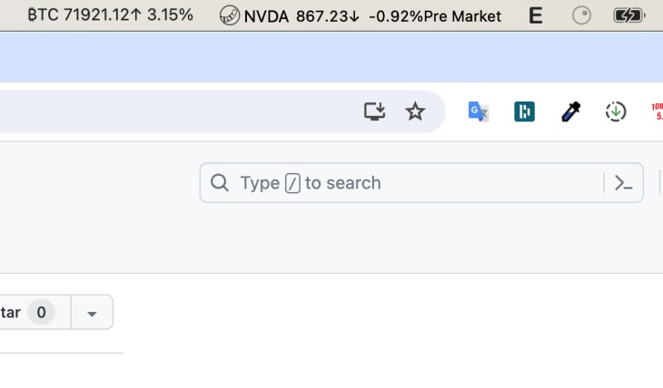

## CryptoBar

CryptoBar is a macOS application designed to conveniently display real-time updates of Bitcoin (BTC) prices directly in your macOS status bar. Built with SwiftUI, CryptoBar provides a minimalist and sleek interface, ensuring seamless integration with your macOS experience.

### Features:

- **BTC Price Updates:** Stay informed with the latest BTC price updates directly in your macOS status bar.
- **Real-Time Data:** Access real-time data to keep track of market fluctuations effortlessly.
- **Minimalist Design:** Designed with a minimalist interface, CryptoBar seamlessly integrates into your macOS environment.

### How to Use:

1. Download the CryptoBar application.
2. Install and run the application on your macOS device.
3. Instantly view the BTC price updates in your macOS status bar.

### Contribution:

Contributions are welcome! Feel free to submit pull requests, report issues, or suggest new features to enhance CryptoBar.

### License:

This project is licensed under the [MIT License](LICENSE).
